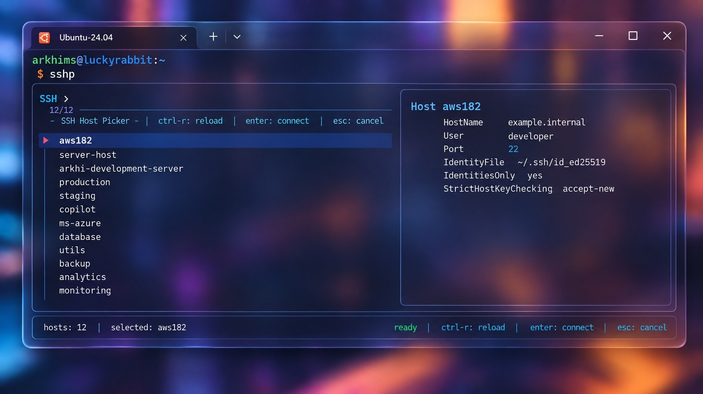

# sshpick

A small, fast SSH host picker for your terminal.

`sshp` reads the aliases you already keep in `~/.ssh/config`, lets you search them with `fzf`, and connects with the normal OpenSSH client. No new connection format, daemon, or credential store.



## Why use it?

Long SSH configs are great until you have to remember whether a host is called `staging-api`, `staging-api-2`, or `staging-api-tunnel`.

`sshp` gives you one searchable list, then shows the resolved connection details before you connect. That includes settings inherited from your SSH config, without exposing private-key contents. Repeated directives are reduced to one row so the preview stays readable.

## Install

Review the installer before running it:

```bash
curl -fsSL https://raw.githubusercontent.com/ArkhiMuttaqina/ssh-picker/main/install.sh
```

Install with:

```bash
curl -fsSL https://raw.githubusercontent.com/ArkhiMuttaqina/ssh-picker/main/install.sh | bash
```

The installer will:

- install `openssh-client` and `fzf` when they are missing;
- install `sshpick` and the `sshp` command in `~/.local/bin`;
- add the local bin directory to your shell PATH when needed;
- back up shell files before editing them; and
- validate the result and restore the backup if validation fails.

For repeatable installs, use a release tag instead of `main`:

```bash
curl -fsSL https://raw.githubusercontent.com/ArkhiMuttaqina/ssh-picker/v1.0.0/install.sh | bash
```

## Usage

```bash
sshp                  # search hosts and connect
sshp --list           # list configured host aliases
sshp --preview myhost # inspect resolved SSH settings
sshp --config ~/.ssh/work.conf
```

The picker ignores wildcard and negated `Host` patterns, so the menu contains concrete host aliases only. On the first run, if the default `~/.ssh/config` does not exist, `sshp` creates the file with private permissions (`700` for `~/.ssh`, `600` for `config`) and tells you where to add your first `Host` alias. An explicitly supplied `--config` path is never created automatically.

## Installer options

```text
--bin-dir DIR       install into a custom directory
--source-file FILE  install from a local checkout
--no-path-update    leave ~/.profile and ~/.bashrc unchanged
--no-install-deps   fail instead of installing missing packages
```

Install from a local checkout:

```bash
bash install.sh --source-file ./sshpick
```

## Security notes

- Read remote scripts before piping them to `bash`.
- Pin a release tag when you need a repeatable install.
- The preview uses `ssh -G` to resolve settings; it does not read private-key contents.
- `sshpick` does not copy your SSH config, keys, known hosts, or credentials.
